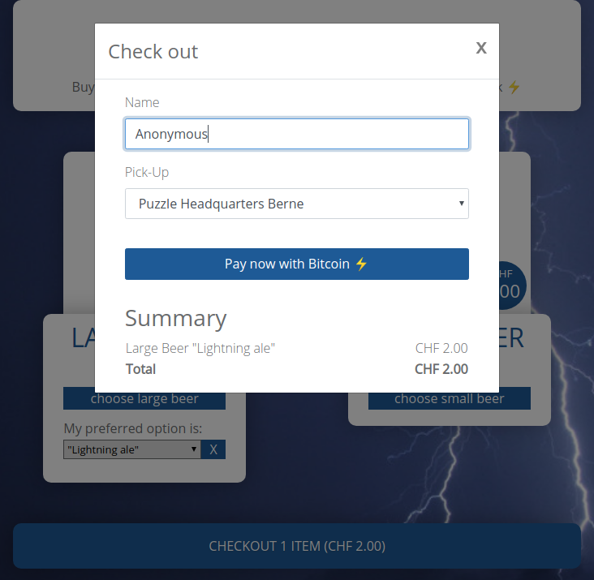
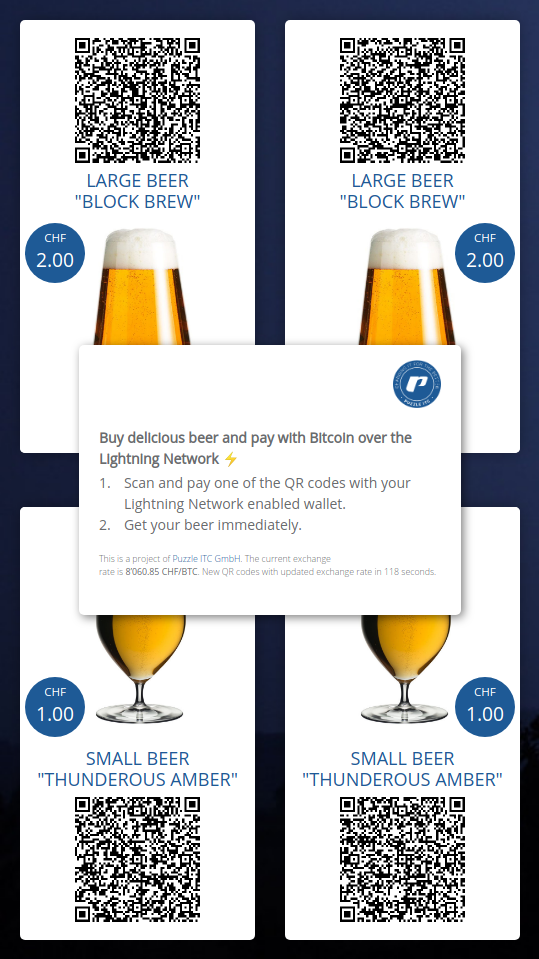
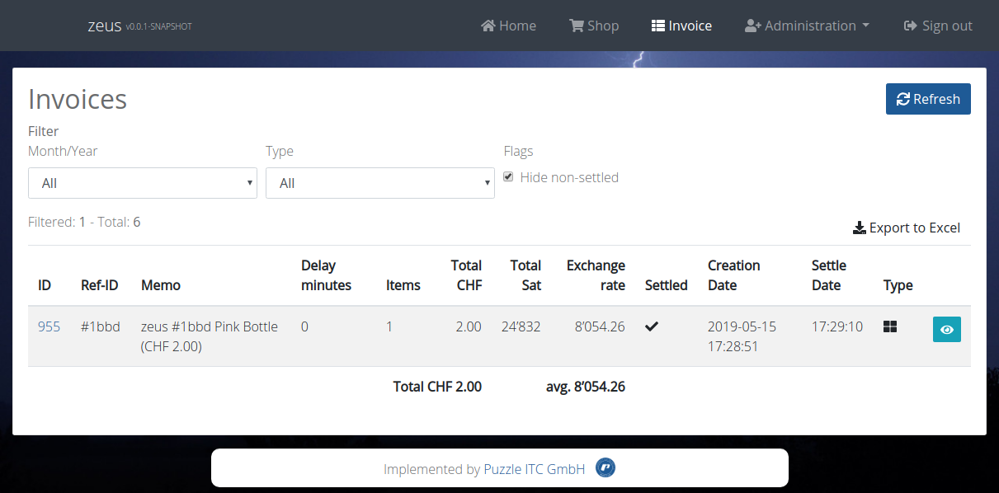
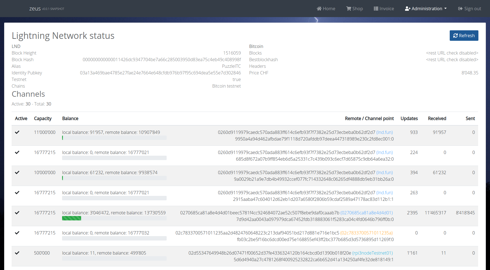

# Zeus Server

Zeus Server is a Lightning Network Point of Sale application for LND, written in Java.

If you are looking for the Mobile App, please visit [ZeusLN/zeus](https://github.com/ZeusLN/zeus).


## Quick Start / How to Use

This chapter will show you how you can quickly start Zeus Server.

You will need:
* Your own LND node (see next chapter)
* `docker` and `docker-compose` installed on your machine


### Set up your own LND node

The Spring Boot backend uses the
[LightningJ Java library](https://www.lightningj.org/) to connect to a
[Lightning Network Daemon (LND)](https://github.com/lightningnetwork/lnd) over
[gRPC](https://grpc.io/). You will need to set up an LND node with version
[`0.6.1-beta`](https://github.com/lightningnetwork/lnd/releases/tag/v0.6.1-beta)
or newer.

There are many tutorials out there but we recommend either 
[this (default)](https://github.com/lightningnetwork/lnd/blob/master/docs/INSTALL.md)
or
[this (docker)](https://github.com/lightningnetwork/lnd/blob/master/docs/DOCKER.md)

This application is network agnostic, so it does not matter if you are running
`testnet` or `mainnet`. But of course we strongly recommend to start with
`testnet` first!

After the LND node is running and is fully synced to the chain, follow the steps
below. We assume that LND saves its files to `~/.lnd/`. If you changed that
path, adjust the following example paths accordingly. 

* Make sure the gRPC port (default `10009`) of the node is open and reachable
* Copy the file `~/.lnd/tls.cert` to the folder `src/main/resources/certs` and also name it `tls.cert`
* Get the hex value of the `invoice.macaroon` and store it somewhere, we'll need
  this later.  
  Use this command for example:  
  `xxd -p -c 999 ~/.lnd/data/chain/bitcoin/testnet/invoice.macaroon`
* Get the hex value of the `readonly.macaroon` and store it somewhere, we'll need
  this later.  
  Use this command for example:  
  `xxd -p -c 999 ~/.lnd/data/chain/bitcoin/testnet/readonly.macaroon`

### Configure application

Now you need to configure the application to use the LND node you just set up.

To do this, edit the file `application-dev.yml` in the folder `backend/src/main/resources/config` and
change the following values:

```yaml
application:
    bitcoin:
        # point this to http://<bitcoind-hostname>:8332/rest/chaininfo.json if you have a full node.
        # set it to 'disabled' if you don't have a bitcoind full node running.
        restUrl: disabled
    mail:
        send: true
        recipient: mail@example.com
    lnd:
        host: localhost
        port: 10009
        certPath: classpath:/certs/tls.cert
        # insert the hex values of the macaroon obtained in the previous step here!
        invoiceMacaroonHex: 0201036c.....
        readonlyMacaroonHex: 0201036c.....
```

The most important thing you need to change is to change the hostname/port and to add the hex values for the
macaroons that you saved somewhere in the previous step.

### Start with docker-compose

This will start the docker images from Docker Hub and mount the configuration file:

`docker-compose up`

Now you should see the application when opening `http://localhost:9000/` in your browser.

### Start development env

To start developing you need to start every component manually:

1. Start DB in background: `docker-compose up -d zeus-db`
1. Start the backend: `cd backend; ../gradlew bootRun`
1. Start the frontend: `cd frontend; yarn install; yarn start`

Now you should see the application when opening `http://localhost:9000/` in your browser.

## Available modules

The following modules have been implemented so far:

### Web Shop

A classic web shop with a shopping cart and a checkout procedure.

URL: `http://host:port/#/shop`




### Self service

A self-order page that only displays a certain number of products that can be ordered by directly paying an
invoice that is shown. Available for portrait or landscape display orientation.

URL: `http://host:port#/self-service/INVOICE-PREFIX`




URL: `http://host:port/#/self-service-landscape/INVOICE-PREFIX`


### Donation

A simple donation form that can be embedded as an iframe for example.

URL: `http://host:port/#/donate/DONATION-TEXT`


### Administrative interface

Apart from the default JHipster admin pages for health, metrics, configuration and log configuration,
there are also two specific interfaces related to the Lightning Network.

URL: `http://host:port/#/admin`

The default username is `admin` and the password is `admin`.

#### Invoice overview

A list of all paid and unpaid invoices, can be filtered by type and date.



#### Node and channel management

An admin interface that shows some node statistics and the current open channels with their balances.




## Advanced Configuration / Customization

We built this application as a template so you can build your own fancy
self-order point of sale screen.
[You can see a demo video of our version here.](https://twitter.com/gugol/status/1042658297927675905)

The following chapters will guide you through the steps that are necessary to
customize the generic `Zeus Server` to your needs.

### Write your own invoice processor

Invoice processors are invoked after a Lightning Network invoice has been
updated. Usually, this means it has been paid/settled. You can write your
own invoice processor by implementing `ApplicationListener<InvoiceEvent>` in 
your service.

There is an example `ch.puzzle.ln.zeus.service.processors.MailSendOrderProcessor`
service that sends out an e-mail whenever an invoice has been paid:

```java
package ch.puzzle.ln.zeus.service.processors;

import ch.puzzle.ln.zeus.service.InvoiceEvent;
import ch.puzzle.ln.zeus.service.MailService;
import ch.puzzle.ln.zeus.service.dto.InvoiceDTO;
import org.springframework.context.ApplicationListener;
import org.springframework.stereotype.Service;

@Service
public class MailSendOrderProcessor implements ApplicationListener<InvoiceEvent> {

    private final MailService mailService;

    public MailSendOrderProcessor(MailService mailService) {
        this.mailService = mailService;
    }

    @Override
    public void onApplicationEvent(InvoiceEvent event) {
        InvoiceDTO invoice = event.getInvoice();
        
        // Make sure we only send an e-mail if the invoice has been settled
        // for the first time.
        if (invoice.isSettled() && event.isFirstSettleEvent()) {
            mailService.sendOrderConfirmation(invoice);
        }
    }
}

```

You can customize this however you want.

### Build your own web GUI

There is a simple generic example self-order store implemented in the web GUI.

To change the products and their price, make sure to edit the following files:

* TODO: config file

To change the way the self-order store looks, edit the following files:

* `src/main/webapp/app/shop/self-service.component.html`
* `src/main/webapp/app/shop/self-service.component.scss`
